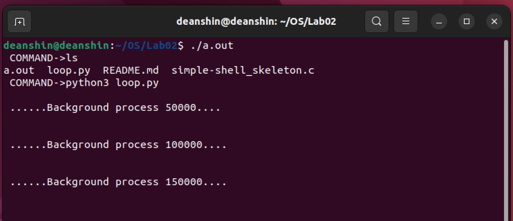
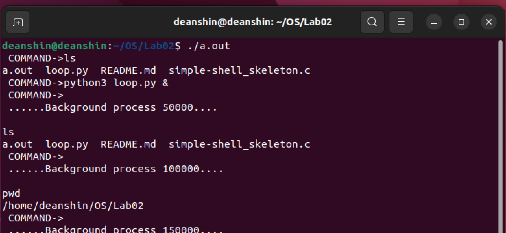

# Running the program

If you do not have gcc installed already, please download it: [https://gcc.gnu.org/install/](https://gcc.gnu.org/install/).

Run the following command to compile the program:

```sh
gcc ./simple-shell_skeleton.c
```

Once you have done that, you can execute the program by executing `./a.out`

# Examples

## Non-background child process:



## Background child process:


