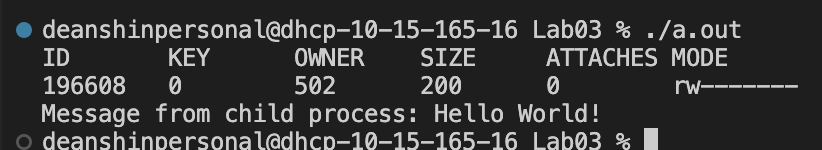

# Running the program

If you do not have gcc installed already, please download it: [https://gcc.gnu.org/install/](https://gcc.gnu.org/install/).

Run the following command to compile the program:

```sh
gcc ./lab3_sms.c
```

Once you have done that, you can execute the program by executing `./a.out`

# Warning
Depending on your operating system, the code may not compile. On Mac, for example the `_key` field has only one underscore, while on Ubuntu, the `__key` field has two underscores. If the code does not work for you, please double check to make sure that all of the fields are correct.

# Examples

