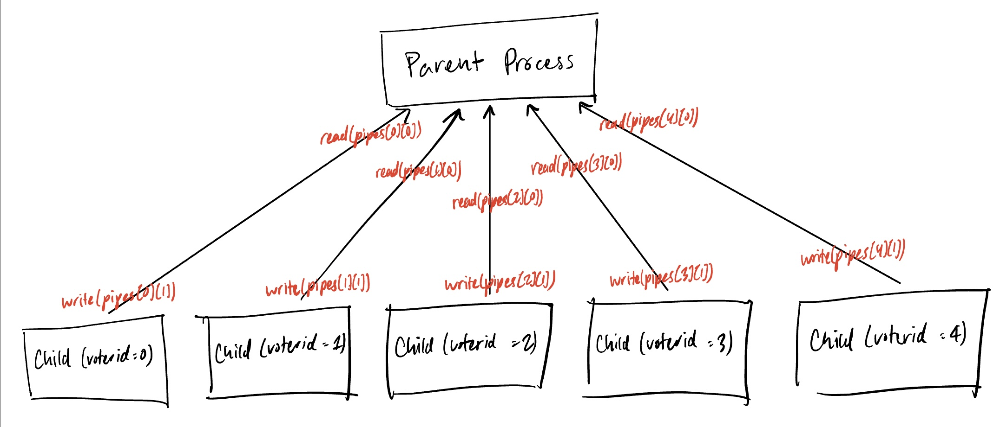
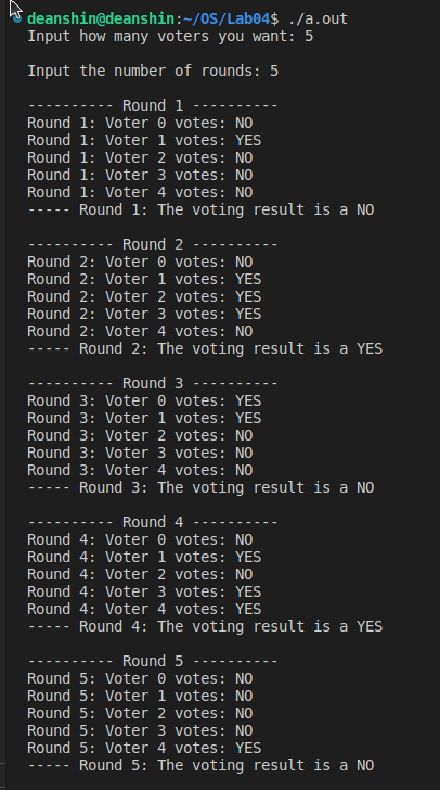

# Process Interaction Diagram

- Each child process sends how it has voted to the parent process.
- The parent process receives votes from all of its child processes, and calculates whether a majority vote occurred.


# Running the program

If you do not have gcc installed already, please download it: [https://gcc.gnu.org/install/](https://gcc.gnu.org/install/).

Run the following command to compile the program:

```sh
gcc ./majorityVoting.c
```

Once you have done that, you can execute the program by executing `./a.out`

# Example
