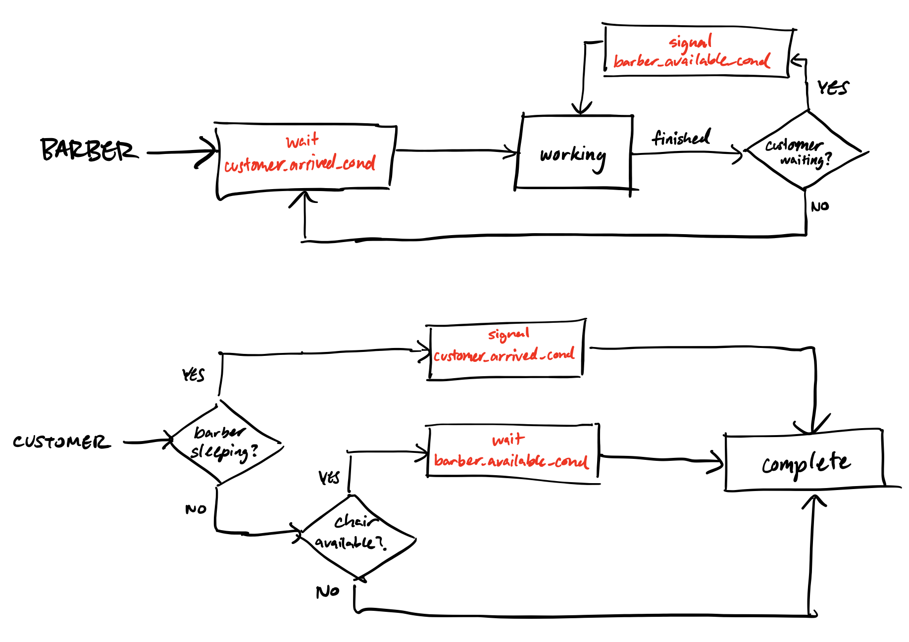
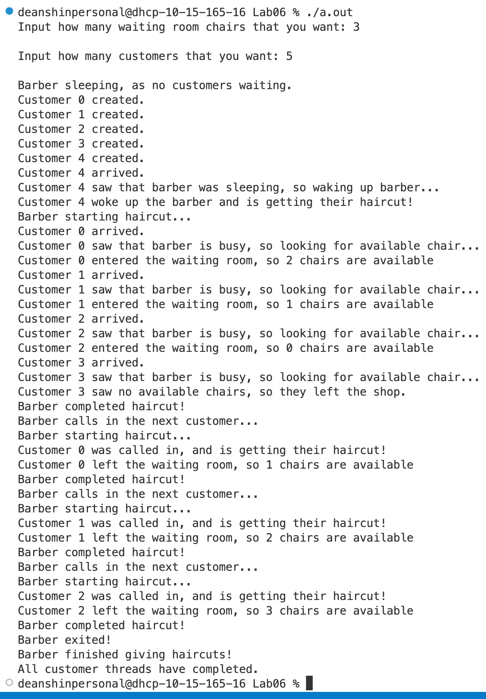

# Thread Interaction Diagram

- The barber is represented by the parent thread
    - The barber waits for the `customer_arrived_cond`.
    - Once the barber finishes their work and if there are any customers waiting, the barber signals the `barber_available_cond`
    - If no customers are waiting, the barber goes back to sleep.
- Each customer is represented by a child thread
    - If the barber is sleeping, the customer signals the `customer_arrived_cond` to wake the barber up.
    - Otherwise, if there is a waiting room chair available, the customer waits for the `barber_available_cond`
    - Otherwise, the customer leaves

# Running the program

If you do not have gcc installed already, please download it: [https://gcc.gnu.org/install/](https://gcc.gnu.org/install/).

Run the following command to compile the program:

```sh
gcc ./barber.c
```

Once you have done that, you can execute the program by executing `./a.out`

# Example
